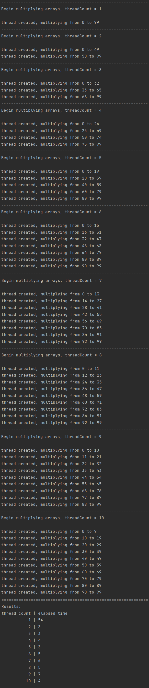

# Реализация многопоточного умножения элементов массивов

В программе реализован класс *MultithreadedArrayMultiplier*.
Данный класс способен умножать элементы одного массива на соответствующие элементы другого в многопоточном режиме.

При создании экземпляра класса *MultithreadedArrayMultiplier* необходимо указать количество потоков,
которое будет использоваться при умножении элементов массивов: 
*MultithreadedArrayMultiplier multiplier = new MultithreadedArrayMultiplier(количество_потоков);*

Умножение производится при помощи метода:
*multiply(double[] array1, double[] array2, double[] resultArray)*

Метод *multiply* обладает следующими входными параметрами:
* *double[] array1* - массив, элементы которого необходимо умножить на соответствующие элементы массива array2
* *double[] array2* - массив, элементы которого необходимо умножить на соответствующие элементы массива array1
* *double[] resultArray* - массив, элементы которого по завершении работы метода будут содержать произведения соответствующих элементов массивов array1 и array2
> Предполагается, что все три массива имеют одинаковую длину.

Пример работы программы для массива из 100 элементов приведен на изображении ниже:
  
